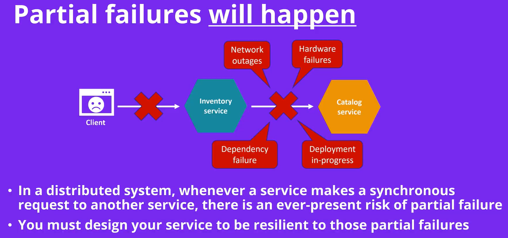
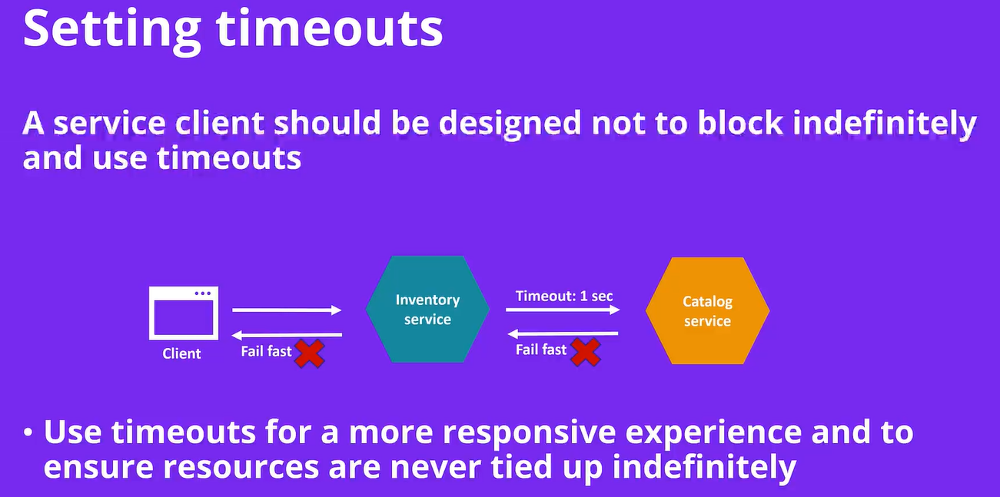
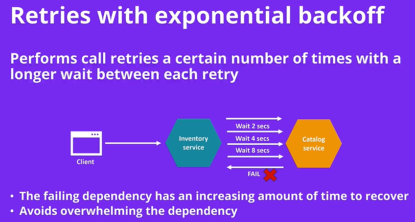

# Partial failures and Exponential Backohh tecnique

In a distributed system, whenever a service makes a synchronous request to anotther service, there is a ever-present risk of partial falire.

* You must design your service to be resilient to those partial failures



## Settings Timeouts

A service client shlod be designed nto to block indefinitely and use timeouts.




## Retries wih Exponential Backoff

Perform call retries a certian number of times with a longer wait between each retry.



```dotnet add package Microsoft.Extensions.Http.Polly```